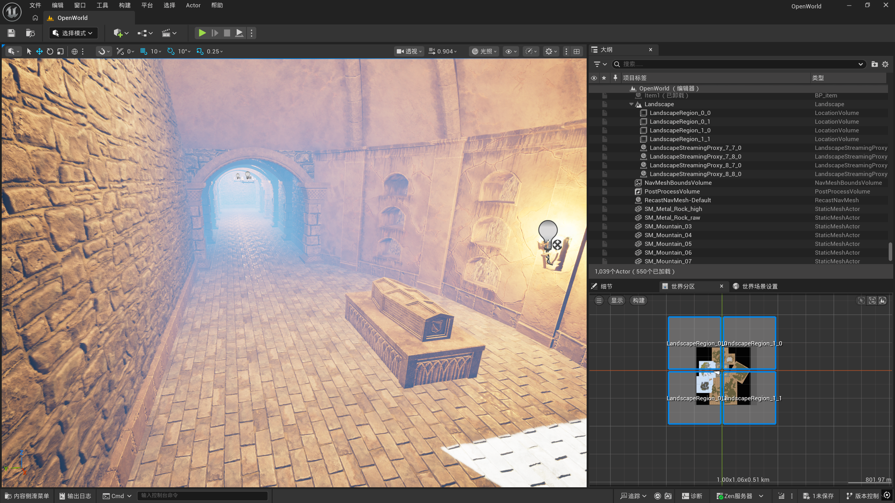
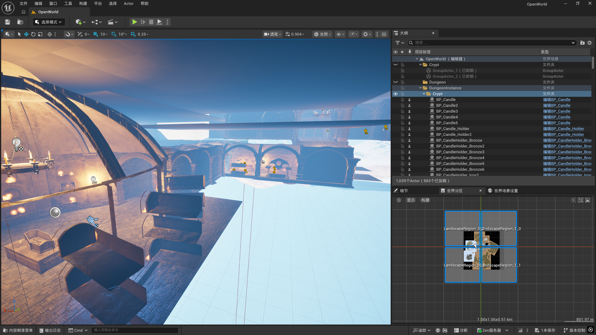
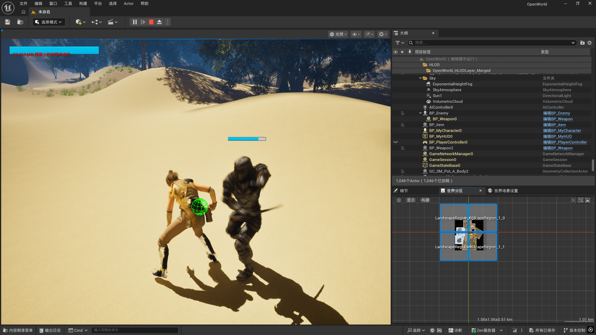
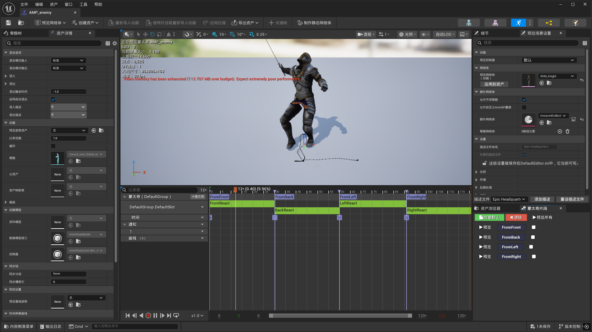
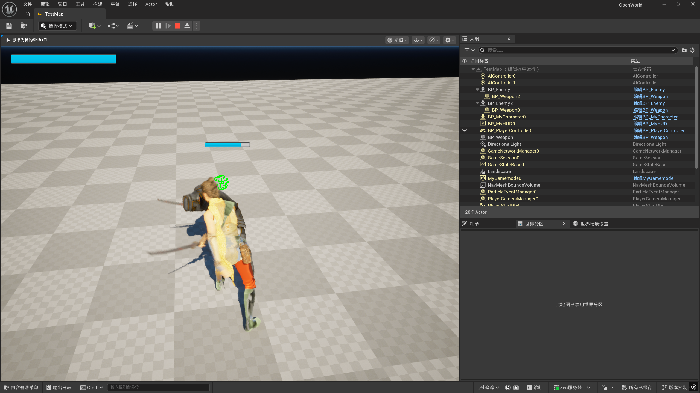
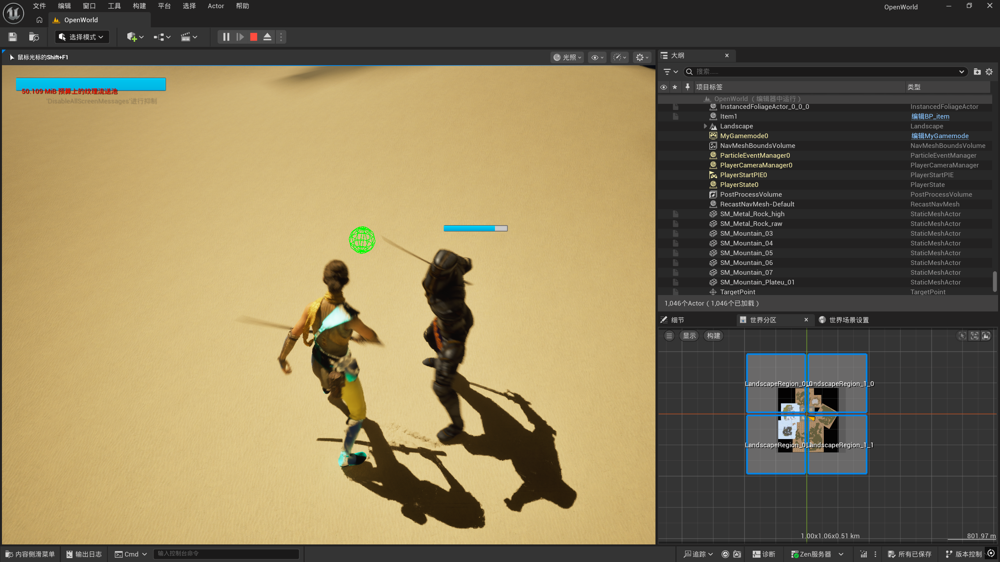
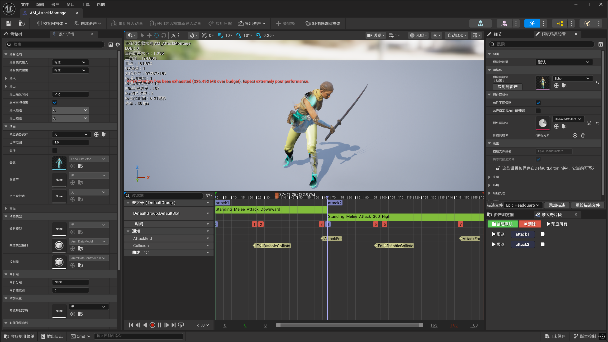
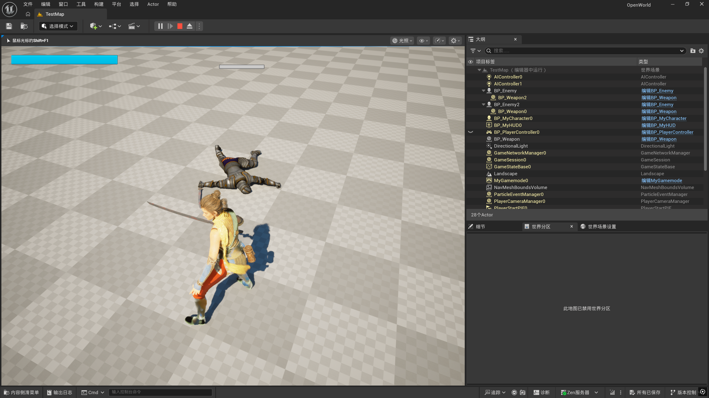
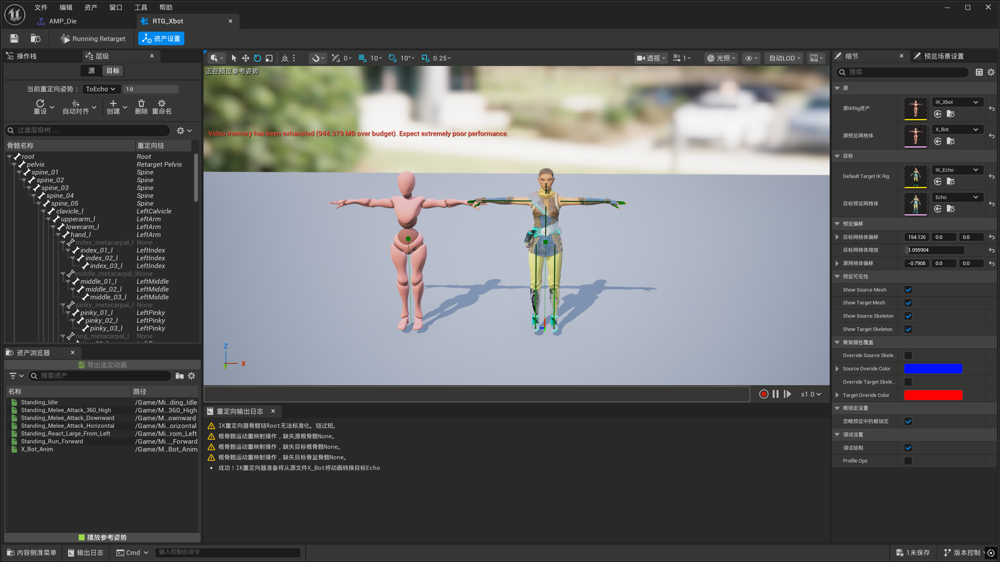

# UE5 Open World Action Demo

基于 Unreal Engine 5 + C++ 开发的第三人称动作游戏 Demo。

## 功能
- 战斗系统（连击 A1/A2）
- AI（巡逻 / 追击 / 攻击）
- 武器拾取（Socket）
- 四方向受击

## 技术
- C++ 主导，蓝图用于动画
- AnimMontage + AnimNotify
- NavMesh + PawnSensing


自建的多区块地图


从Fab中加入了地牢关卡






### AI定点巡逻演示
<video src="https://github.com/user-attachments/assets/fb73d674-f3b2-4513-b0ee-11d4262e233c" width="800" controls></video>


通过pawnseeing组件看到角色进行追踪


<video src="https://github.com/user-attachments/assets/3b3bd9ff-f334-4f39-9a62-89a17170f668" width="800" controls></video>


达到一定距离的时候会对主角进行攻击




角色靠近武器时按E 可以拾取武器

<video src="https://github.com/user-attachments/assets/38eb948a-2baf-44be-bfb0-4960f8a9d172" width="800" controls></video>

角色两段攻击


<video src="https://github.com/user-attachments/assets/1b72e354-444f-4bdf-afd9-474d5cd6eda7" width="800" controls></video>

```c++
void AMyCharacter::Attack()
{
	
		if (ActionState == EActionState::ECS_Unoccupied && GetCharacterState() == ECharacterState::ECS_EquippedOneHandWeapon) {
			ActionState = EActionState::ECS_Attacking;


			if (ComboAttackNum == EComboStage::attack1) {

				FName AttackNum("attack1");
				AttackMontagePlay(AttackNum);
				ComboAttackNum = EComboStage::attack2;

				GetWorld()->GetTimerManager().SetTimer(
					ComboTimerHandle,
					this,
					&AMyCharacter::ResetCombo,
					1.8f,
					false);
			}
			else if (ComboAttackNum == EComboStage::attack2) {

				FName AttackNum("attack2");
				AttackMontagePlay(AttackNum);
			}
	}
}
```

在第一段攻击后通过时钟获得一个倒计时窗口 窗口内接收到第二次按键 就执行攻击2


在击中缸时会施加一个临时场将物体打碎，同时会施加一个线性径向场将碎片击飞(未成功实现，还在找bug)

<video src="https://github.com/user-attachments/assets/053510e4-45a6-4d2d-bc5c-532af781fc48" width="800" controls></video>


根据向量的点乘和叉乘实现了ai的先后 左右受击

```c++
	FVector Forward = GetActorForwardVector();
	FVector HitReactDirection = (Point - GetActorLocation()).GetSafeNormal();

	FVector UnitHitReactDirection(HitReactDirection.X, HitReactDirection.Y, Forward.Z);

	float CosTheta = FVector::DotProduct(Forward, UnitHitReactDirection);
	float ThetaRadian = FMath::Acos(CosTheta);
	float Theta = FMath::RadiansToDegrees(ThetaRadian); //点乘获得角度 判断前后
	const FVector CrossProduct = FVector::CrossProduct(Forward, UnitHitReactDirection);

	if (CrossProduct.Z < 0) {
		Theta *= -1.f;
	} //叉乘判断左右

	FName Dir;
	if (Theta >= -45.f && Theta < 45.f) {
		Dir = FName("FromFront");
	}
	else if (Theta >= 45.f && Theta <= 135.f) {
		Dir = FName("FromRight");
	}
	else if (Theta >= -135.f && Theta < -45.f) {
		Dir = FName("FromLeft");
	}
	else {
		Dir = FName("FromBack");
	}
	HitReactMontagePlay(Dir);
```



ai右侧受击  同时 ai在受到攻击后会显示血条 同时获得攻击对象 当攻击对象距离较远的时候 会隐藏血条



ai左侧受击




蒙太奇动画通过enable 和disable通知来控制 手上的武器是否能进行攻击

为了避免动画被连续触发 在montage开始的时候角色状态会被设置为攻击 在attackend之后才会将当前角色状态改为休闲  攻击状态下无法调用播放函数



ai死亡



<video src="https://github.com/user-attachments/assets/3fd308e1-c979-4305-952a-f971e8e7fd65" width="800" controls></video>


通过ik重定向 将别的骨骼动画重定向到当前角色上

